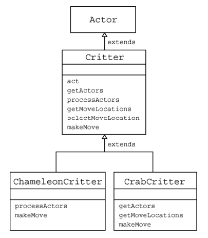

# Gridworld Interactions
## Case Study
This section is based on the [CollegeBoard GridWorld Student Manual](https://secure-media.collegeboard.org/apc/GridWorld_Case_Study_Student_Manual_with_Appendixes_Aug_2007_updated.pdf) (with modifications). Feel free to flip through this document!

For this problem set, we will be studying the `critters` demo project. Use that code and the source code in `gridWorld` to answer the following questions.

### Critter
1. What is an `ArrayList`?

An ArrayList is like an array, except it can change its size. It's a list (linear structure that can change size). Java actually uses arrays to implement the structure. 

2. What are the five basic actions common to all critters when they act?
> _Note:_ It is usually not a good idea to override the `act` method in a `Critter` subclass; if you find it unsuitable, consider extending `Actor` instead.

getActors(): get the actors in the neighboring grid locations
processActors(): remove all actors that are not rocks or critters
getMoveLocations(): get the possible next move locations (usually the empty neighboring grid cells)
selectMoveLocatation(): randomly choose a move location out of the possible move locations (return current location if there are not possible move locations)
makeMove(): move the critter to a given location.

3. Should subclasses of Critter override the `getActors` method? Explain.

They should only override getActors() if it is necessary that they use a different method for getActors() than what is in Critter (which only gets the neighboring actors). 

4. What three methods must be invoked to make a critter move? Explain each of these methods.

getMoveLocation(): get the possible next move locations (usually the empty neighboring grid cells)
selectMoveLocatation(): randomly choose a move location out of the possible move locations (return current location if there are not possible move locations)
makeMove(): move the critter to a given location.

5. Why is there no `Critter` constructor?

There is no Critter constructor because there already is a constructor for Actor, a superclass of Critter. This will means the Critter constructor is not necessary (it can use the Actor constructor instead). If we try to call the constructor for Critter, then it will call the Actor constructor.

6. What does a `Critter` do when it calls `processActors`? What is removed, and how?

It removes all Actors that are not Rocks or Critters by getting each of these actors to remove themselves from the grid.

The following image describes the relationship between `Critter` and its super/subclasses.

### ChameleonCritter
7. Why does `act` cause a `ChameleonCritter` to act differently from a `Critter` even though `ChameleonCritter` does not override `act`?

ChameleonCritter has other methods called in act() that are overridden, such as processActors(), which randomly chooses a neighbor whose color it will match, rather than removing non-rocks/Critters and makeMove(), which causes it to turn towards the direction it moves in.

8. Explain `super.makeMove`, which appears in the `makeMove` method of `ChameleonCritter`.

This uses makeMove() from a superclass of ChameleonCritter, rather than going up from ChameleanCritter itself (it overrides the override).

9. Why doesn't `ChameleonCritter` override the `getActors` method?

Since the ChameleonCritter looks at the neighboring actors, which is the same as getActors for Critter, then it doesn't need a different method for itself.

10. Which class contains the `getLocation` method?

Actor

11. How can a `Critter` access its own grid?

It can use getGrid()

### CrabCritter
12. Which neighbors does a `CrabCritter` eat, and how does it move?

It eats the neighbors that are in the front-left, front-right, or directly in front of it if if they are not rocks or Critters. With moving, it moves to the location that was passed (must be immediately to the left or right. If it can't move, then it randomly turns left or right instead.)

13. Why doesn't `CrabCritter` override the `processActors` method?

It does not override processActors() because it uses the same method as in Critter. 

14. Explain how `getActors` works.

It looks in the directions that are directly ahead, to the front-left, and to the front-right of the CrabCritter and gets the Actor in each of those locations.

## Problem Set #2: Beach Creatures
Create a project named `beachCreatures`. Be sure to add it to the source path as well so you can run the project via VS Code. The creatures should behave as described. You **do not** have to submit your runner; however, you should make sure that these creatures behave correctly in a `BoundedGrid`.

Each creature also has a corresponding `.gif` that is 48x48 pixels. These image files must be in the same folder as the class file if you want them to be used.

> _Note:_ You may have noticed that Actors automatically turn blue. If you do not want that to happen, call `setColor(null)` in the constructor to use an unmodified image.

You **do not** need to override each method for the Chameleons; your first step should be to decide which of the five methods (`getActors`, `processActors`, `getMoveLocations`, `selectMoveLocation`, `makeMove`) should be changed to get the desired result.

1. `LonelyChameleon` extends `ChameleonCritter` and behaves exactly like `ChameleonCritter`, except when there are no actors around it, it will darken (like a flower).
2. `NearsightedChameleon` extends `LonelyChameleon` and can only look in front or behind it when changing colors.
_Hint:_ you will need to look at `Location` to figure out how to access the specific tiles.

3. `TownCrier` extends `Critter` and thrives off attention. It looks at all neighbors within 2 tiles away and counts the number of `Critters`. If that number is greater than some threshold `t`, it will turn green. Otherwise, it will turn red. `t` is a parameter in the constructor. _Hint:_ use its `Location` to find all Critters in its range. Use `instanceof` to check if an actor is a `Critter`.
4. `AngryCrab` extends `CrabCritter` and causes all adjacent `Actor`s to move one step further away from the `AngryCrab`. If the actor cannot move away, the `AngryCrab` removes it from the grid. Once `AngryCrab` has completed processing the actors, it moves like a `CrabCritter`.

For the following classes, you should use `putSelfInGrid` and `removeSelfFromGrid` instead of `put` and `remove` to manipulate `Rock`s.

5. `RockMason` will try to spawn up to 2 `Rock`s in an empty adjacent location. If it is surrounded, then it will dig underground and emerge at a random unoccupied location in the world. If there are no unoccupied locations, then it will sit and wait until there is one. `RockMason` cannot build and move in the same turn.
6. `RockHound` loves to eat `Rock`s (i.e. removes rocks from the world), and can reach any rock that is adjcaent to it. If it cannot reach a rock, it will turn toward a rock in the world and move in that direction. If there are no rocks in the world, then it will sit and wait until there is one. `RockHound` cannot eat and move in the same turn.
7. Explain why `RockMason` and `RockHound` will eventually freeze if they are in the same world. (So you should first test them separately!)

If they are in the same world, they will eventually freeze because the RockMason will produce rocks at the same time that the RockHound eats them. Since the RockMason will produce more rocks than the RockHound can eat, then the RockMason will eventually find itself surrounded by Actors. Then, the RockMason and RockHound will be simultaneously creating and eating rocks, and they will remain stuck because they cannot move while making/eating rocks.

      1. What changes could you make to their behavior to prevent this from happening?

      To prevent this from happening, I would make them move randomly while making/eating rocks. This would allow them to move while making/eating rocks. For the RockMason, I would also only make it move randomly if it was not surrounded.